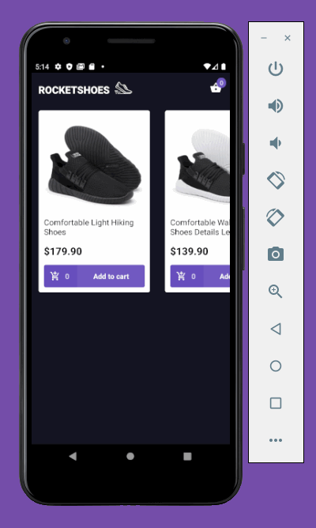

<h1 align="center">
  
</h1>

<h3 align="center">RocketShoes Store</h3>

---

 This project is about a shoes store.
     

## 📝 Table of Contents

- [About](#about)
- [Demo](#demo)
- [Getting Started](#getting_started)
- [Deployment](#deployment)
- [Usage](#usage)
- [Built Using](#built_using)
- [Authors](#authors)
- [Acknowledgments](#acknowledgement)

## 🧐 About 

This is a study case project.

## Demo

## 🏁 Getting Started 

These instructions will get you a copy of the project up and running on your local machine for development and testing purposes. See [deployment](#deployment) for notes on how to deploy the project on a live system.

### Prerequisites

- NodeJs version 12.14.1 or above
- Yarn version 1.21.1. or above
- Android Studio and Android Emulator installed

### Installing

- Clone the repository
- To install all dependecies just run yarn
- Run json-server server.json -p 3333 -w
- Run react-native run-android to install the app on your android emulator

## ⛏️ Built Using 

axios

- [axios](https://github.com/axios/axios) - axios
- [immer](https://github.com/immerjs/immer) - immer
- [polished](https://github.com/styled-components/polished) - polished
- [react](https://github.com/facebook/react) - react
- [react-native](https://github.com/facebook/react-native) - react-native
- [react-native-gesture-handler](https://github.com/software-mansion/react-native-gesture-handler) - react-native-gesture-handler
- [react-navigation](https://github.com/react-navigation/react-navigation) - react-navigation
- [react-native-vector-icons](https://github.com/oblador/react-native-vector-icons) - react-native-vector-icons
- [reactotron-react-js](https://github.com/infinitered/reactotron) - reactotron-react-js
- [styled-components](https://github.com/styled-components/styled-components) - styled-components
- [redux](https://github.com/reduxjs/redux) - redux
- [react-redux](https://github.com/reduxjs/react-redux) - react-redux
- [redux-saga](https://github.com/redux-saga/redux-saga) - redux-saga
- [prettier](https://github.com/prettier/prettier) - Prettier
- [eslint](https://github.com/eslint/eslint/) - eslint
- [eslint-config-prettier](https://github.com/prettier/eslint-config-prettier) - eslint Config Prettier
- [eslint-plugin-import](https://github.com/benmosher/eslint-plugin-import) - eslint plugin import
- [eslint-plugin-prettier](https://github.com/prettier/eslint-plugin-prettier) - eslint plugin prettier
- [eslint-config-airbnb-base](https://github.com/airbnb/javascript/tree/master/packageseslint-config-airbnb-base) - packageseslint-config-airbnb-base

## ✍️ Authors 

- [@arllain](https://github.com/arllain)
